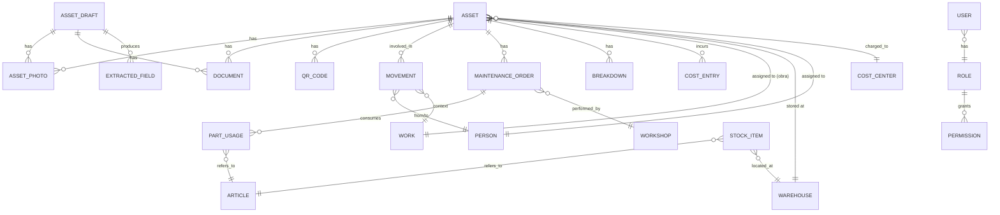

# Plataforma de Gestão de Ativos — Grupo DG

Documento de arquitetura, requisitos e plano de implementação (Fase 1 — Sistema Autónomo).

## 1. Resumo executivo

Sistema próprio, autónomo e modular para gestão do ciclo de vida completo de viaturas,
máquinas, equipamentos, ferramentas, peças e materiais controlados do Grupo DG —
identificação, documentação, localização, atribuição, movimentos, manutenção, avarias,
custos, stock e relatórios — com criação assistida de fichas por OCR/IA, QR Code por
ativo, funcionamento offline em obra, e uma arquitetura preparada (mas não dependente)
para integração futura com qualquer ERP (PHC, Primavera, SAP, Sage, Odoo, ...).

A primeira versão (Fase 1) funciona 100% sem ligação a sistemas externos: base de
dados própria, autenticação própria, todos os módulos de negócio implementados
internamente. Nenhuma integração é necessária para o sistema ser útil no dia 1.

## 2. Pressupostos adotados

- O Grupo DG ainda não decidiu qual será o primeiro ERP a integrar (secção 46,
  Fase 3) — por isso nenhum conector é implementado nesta fase, só a interface.
- "OCR e IA" na Fase 1 são implementados como um **pipeline assíncrono com
  extratores plugáveis**. Nesta entrega o extrator ativo é um `MockExtractor`
  determinístico (sem custos de API externa nem credenciais). A interface
  `OcrExtractor` é o ponto de substituição por Azure Document Intelligence,
  AWS Textract/Rekognition ou Google Vision, sem alterar o resto do sistema.
- "Previsão de manutenção" e "deteção de padrões anormais" (secções 16–19) são
  implementadas como regras estatísticas explicáveis sobre o histórico
  (médias móveis, desvio-padrão, MTBF) e não como modelos de ML treinados —
  mantém-se auditável e evita caixa-negra num domínio de segurança de obra.
  A interface fica preparada para um motor de ML futuro.
- Nenhum campo específico de ERP (ex.: "código de artigo PHC") é usado como
  chave interna — ver secção 8 (Identificadores universais).
- Frontend: React + TypeScript + Vite (PWA). Backend: NestJS + TypeScript
  (Node), ORM Prisma, PostgreSQL. Justificação na secção 12.

## 3. Arquitetura

Clean Architecture / DDD-lite, 4 camadas, aplicada dentro de cada módulo do
backend (`apps/api/src/modules/<modulo>/{domain,application,infrastructure,interface}`):

```
interface/       controllers REST, DTOs, guards
application/      use-cases / services de aplicação, orquestração
domain/           entidades, value objects, regras de negócio, eventos
infrastructure/   repositórios Prisma, adaptadores externos (storage, OCR, filas)
```

Regras:
- `domain/` não importa nada de `infrastructure/` nem de bibliotecas de terceiros
  de framework (sem decorators do Nest, sem Prisma Client).
- Comunicação entre módulos apenas via *application services* e **eventos de
  domínio** (EventEmitter interno; substituível por filas — BullMQ/Redis — sem
  tocar no domínio).
- Nenhum módulo de negócio importa código de um conector de integração.
  A dependência é sempre `integration-hub → módulo`, nunca o inverso.

```
Client (Web/PWA) ──HTTPS/REST──▶ API Gateway (Nest)
                                     │
                    ┌────────────────┼────────────────────┐
                    ▼                ▼                     ▼
              Módulos de         Integration Hub      OCR/AI Pipeline
              negócio (13)       (conectores, mapping,  (filas + extratores
              (assets, qr,        filas, webhooks)       plugáveis)
              movements,               │                      │
              maintenance,             ▼                      ▼
              breakdowns,        Sistemas externos      Object Storage
              stock, docs,       (futuro, desligado      (fotos/documentos)
              audit, users...)   por omissão)
                    │
                    ▼
              PostgreSQL (schema próprio, sem tabelas de ERP)
```

### 3.1 Módulos de negócio (Fase 1)

`auth`, `users` (perfis/permissões), `assets` (cadastro genérico de
viatura/máquina/ferramenta/peça), `qrcode`, `movements` (entrega/devolução/
transferência), `maintenance` (+ regra de peças substituídas), `breakdowns`
(avarias), `stock` (artigos, peças, armazéns), `documents` (gestão
documental), `works` (obras/centros de custo), `partners` (colaboradores,
fornecedores, oficinas, clientes), `audit` (auditoria + soft delete),
`reports`, `alerts`, `ocr` (pipeline OCR/IA), `integration-hub` (Fase 2,
scaffolded já na Fase 1 mas sem conectores ativos).

## 4. Identificadores universais (regra obrigatória)

Toda a entidade principal tem:

| Campo | Tipo | Descrição |
|---|---|---|
| `id` | UUID v4 | chave primária interna, nunca exposta como "amigável" |
| `internalCode` | string única legível | ex. `VT-2026-00042`, gerado pela app |
| `externalCode` | string opcional | código no sistema externo, se existir |
| `sourceSystem` | enum | `INTERNAL` \| `PHC` \| `PRIMAVERA` \| ... (extensível) |
| `syncState` | enum | `NOT_SYNCED` \| `PENDING` \| `SYNCED` \| `CONFLICT` \| `ERROR` |
| `createdAt` / `updatedAt` | timestamp | |

Nunca se usa uma chave de ERP como chave primária da aplicação (regra
obrigatória #3 do pedido). Ver `packages/shared/src/universal-entity.ts`.

## 5. Modelo de dados (núcleo Fase 1)



O `schema.prisma` completo (fonte de verdade) está em
`apps/api/prisma/schema.prisma`.

### 5.1 Estados do ativo (secção 6 do pedido)

`DRAFT → PROCESSING → PENDING_VALIDATION → VALIDATED → ACTIVE` e depois
`AVAILABLE | IN_USE | RESERVED | IN_TRANSIT | IN_MAINTENANCE | BROKEN |
BLOCKED | LOST | INACTIVE | DECOMMISSIONED | ARCHIVED`. Máquina de estados em
`domain/asset/asset-status.state-machine.ts`, com transições validadas — não
é possível gerar QR Code fora de `VALIDATED`+ (secção 4 do pedido).

## 6. Fluxo de criação de ficha assistido por OCR/IA

1. **Tipo de ativo** → 2. **Fotos/documentos** (upload, associados a um
`AssetDraft`) → 3. **Processamento assíncrono** (fila `ocr-jobs`): cada
documento/foto gera um `ExtractionJob`; o `OcrExtractor` ativo devolve
`ExtractedField[]` com `{ field, value, confidence, sourceDocumentId,
sourceImageId }` → 4. **Deteção de duplicados** (secção 7) corre sobre os
campos extraídos com confiança suficiente → 5. **Validação humana**: o
rascunho é apresentado com os campos, a confiança e a origem; nada é gravado
como definitivo sem confirmação (`ExtractedField.status =
CONFIRMED|CORRECTED|REJECTED`, sempre com `validatedBy` + `validatedAt`) →
6. **Criação definitiva**: `AssetDraft → Asset`, atribuição de UUID, código
interno, histórico inicial (`AuditLog`), e o rascunho fica arquivado (nunca
apagado).

Nenhum campo extraído por IA é gravado em `Asset` sem passar por
`ExtractedField.status = CONFIRMED`.

## 7. Deteção de duplicados

Antes da criação definitiva, `assets/application/duplicate-detector.service.ts`
procura por: matrícula exata, VIN exato, número de série exato, código
externo exato, e uma pontuação de semelhança (marca+modelo+ano+categoria).
Duplicado provável (score ≥ limiar) bloqueia a criação automática e exige
decisão humana (`merge`, `keep-both-approved`, `reject`), registada em
`AuditLog`.

## 8. QR Code

- Gerado apenas quando `Asset.status ∈ {VALIDATED, ACTIVE, ...}` e passam
  todas as verificações de campos obrigatórios/fotos/documentos mínimos
  (`qrcode/application/qr-eligibility.service.ts`).
- O conteúdo do QR é `https://app.dg/a/{token}` — `token` é um valor opaco
  aleatório (não é o UUID nem contém dados), resolvido no backend para o
  `assetId`. Nenhum dado confidencial vai no código.
- Um ativo tem no máximo **um QR Code principal ativo**; reimpressão gera
  novo `QrCodeVersion` e mantém histórico (`emitted`, `reprinted`,
  `replaced`, `deactivated`, motivo, utilizador, data).
- Scan resolve permissões do utilizador antes de devolver dados (RBAC).

## 9. Regra obrigatória das peças substituídas (secção 14)

`maintenance/domain/part-return-policy.ts`: toda a `PartUsage` associada a
uma viatura precisa de `returnStatus ∈ {RETURNED_TO_VEHICLE,
DELIVERED_TO_RESPONSIBLE, EXEMPT, NOT_RETURNED_JUSTIFIED}`. `EXEMPT` só é
automático para artigos marcados `category = OIL | FILTER`. Uma
`MaintenanceOrder` de viatura **não pode transitar para `CLOSED`** se existir
alguma `PartUsage` sem `returnStatus` definido e (quando aplicável) sem foto
e sem aprovação do responsável — validado em
`maintenance/domain/maintenance-order.entity.ts#close()`, que lança
`PartsNotAccountedForError`.

## 10. Offline / PWA

Frontend Vite PWA com `vite-plugin-pwa`, `IndexedDB` (via `idb`) como fila
local de: leituras de QR offline, entregas/devoluções/transferências,
fotos, avarias reportadas, leituras de km/horímetro. Ao reconectar, um
`SyncManager` envia a fila para `/api/v1/sync/batch`, idempotente por
`clientOperationId` (UUID gerado no dispositivo), com resolução de conflitos
"last-write-wins com registo do conflito" + fila de revisão manual quando o
`updatedAt` do servidor for mais recente que o `baseUpdatedAt` do cliente.

## 11. Integration Hub (Fase 2 — scaffold presente, inativo)

`apps/api/src/modules/integration-hub/`:
- `Connector` (interface): `test()`, `pull(entity, since)`, `push(entity,
  payload)`, `mapFields(direction)`.
- `ConnectorRegistry`: regista conectores por nome; nenhum registado por
  omissão.
- `FieldMapping`: tabela configurável `internalField ↔ externalField` por
  `(connectorName, entityType)`, editável sem deploy.
- `SyncQueue`: fila (BullMQ) para sync agendada/tempo real, idempotente.
- `data-ownership` por entidade: `INTERNAL_MASTER | EXTERNAL_MASTER |
  BOTH_EDITABLE | IMPORT_ONLY | EXPORT_ONLY | REQUIRES_APPROVAL`.

Adicionar um conector novo = implementar `Connector` + registar; **zero
alterações** aos módulos de negócio (Regra obrigatória #13/#14 do pedido).

## 12. Escolha tecnológica e justificação

| Camada | Escolha | Justificação |
|---|---|---|
| Frontend | React + TypeScript + Vite, PWA | ecossistema maduro, PWA de 1ª classe, grande disponibilidade de programadores PT |
| Backend | NestJS + TypeScript | Clean Architecture nativa (módulos/DI), mesma linguagem que o frontend reduz custo de manutenção, ecossistema para filas/OCR/storage maduro |
| BD | PostgreSQL | JSONB para campos extensíveis, robustez transacional, custo baixo, disponível em qualquer cloud |
| ORM | Prisma | migrações versionadas, type-safety ponta-a-ponta |
| Filas | BullMQ (Redis) | processamento assíncrono de OCR/relatórios desacoplado do pedido HTTP |
| Storage | S3-compatible (MinIO local / S3 ou Blob em produção) | portável entre clouds |
| Auth | JWT + refresh, RBAC próprio; interface preparada para OAuth2/OIDC/MFA | autonomia na Fase 1, upgrade sem reescrever domínio |
| Containers | Docker + docker-compose | paridade dev/prod, fácil deploy em qualquer cloud |

## 13. Segurança (Fase 1)

Hashing Argon2id de passwords, JWT de curta duração + refresh token
rotativo, RBAC por módulo/ação/obra/armazém/centro de custo, rate-limiting
por IP+utilizador, validação de input (`class-validator`) em todas as
fronteiras, logs estruturados sem dados sensíveis, segredos apenas por
variáveis de ambiente (nunca no código), soft delete + auditoria
imutável para registos críticos, upload de ficheiros validado por
tipo/tamanho e verificado antes de servir.

## 14. Perfis (RBAC)

`ADMIN, DIRECTION, FLEET_MANAGER, EQUIPMENT_MANAGER, SITE_SUPERVISOR,
WAREHOUSE_MANAGER, MECHANIC, WORKSHOP, DRIVER, OPERATOR, EMPLOYEE, AUDITOR,
INTEGRATION_TECH` — seed em `prisma/seed.ts`, `Permission` granular
`module:action` (ex. `assets:create`, `maintenance:close`,
`qrcode:reprint`), atribuível por papel e, opcionalmente, por âmbito
(obra/armazém/centro de custo).

## 15. Plano por fases

- **Fase 1 (esta entrega — scaffold funcional):** módulos de negócio
  acima, OCR pipeline com extrator mock, QR Code, offline scaffold, API
  documentada (OpenAPI), auditoria, importação/exportação CSV.
- **Fase 2:** Integration Hub completo (filas reais, webhooks, painel de
  integrações, resolução de conflitos ponta-a-ponta).
- **Fase 3:** primeiro conector real (a decidir pelo Grupo DG).
- **Fase 4:** conectores adicionais, sem alterar módulos principais.

## 16. Estrutura de pastas

```
dg-asset-platform/
  ARCHITECTURE.md
  docker-compose.yml
  apps/
    api/            NestJS backend
      prisma/schema.prisma
      prisma/seed.ts
      src/modules/{auth,users,assets,qrcode,movements,maintenance,
                    breakdowns,stock,documents,works,partners,audit,
                    reports,alerts,ocr,integration-hub,sync}
      src/common/    guards, decorators, filters, interceptors
    web/            React + TS + Vite PWA
      src/pages, src/components, src/api, src/offline
  packages/
    shared/          tipos partilhados frontend/backend
```

## 17. Como correr localmente

```bash
cd dg-asset-platform
cp apps/api/.env.example apps/api/.env
docker compose up -d db redis minio
cd apps/api && npm install && npx prisma migrate dev && npm run seed && npm run start:dev
cd ../web && npm install && npm run dev
```

API em `http://localhost:3000/api/v1`, docs Swagger em
`http://localhost:3000/api/docs`, Web em `http://localhost:5173`.

## 18. O que fica fora desta entrega (transparência)

- Extração real por visão computacional/OCR de cloud (interface pronta,
  extrator mock ativo).
- Modelos de ML para previsão de manutenção/deteção de padrões (regras
  estatísticas explicáveis ativas; interface pronta para um motor de ML).
- Conectores de ERP reais (Fase 3, a aguardar decisão do Grupo DG).
- Envio real de push/SMS (interface `NotificationChannel` pronta,
  implementação de e-mail via SMTP incluída; push/SMS por adaptador).
- App nativa — a PWA cobre o requisito de telemóvel/tablet/computador.
